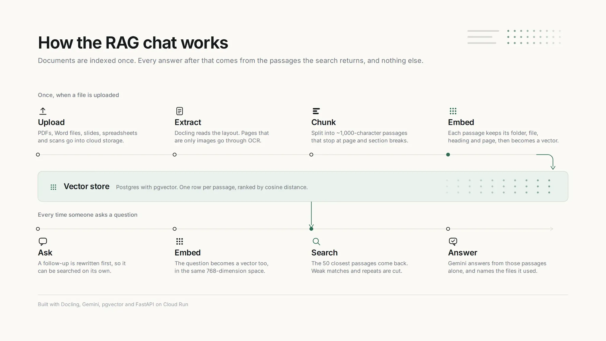

# RAG Bot

RAG Bot is a retrieval-augmented generation application for asking questions about uploaded documents. It extracts and embeds file contents, retrieves the most relevant chunks for each question, and gives Gemini grounded context for its answer.

[Open the live application](https://chatbot-ui-zeta-eight-78.vercel.app/) · [Tree-RAG backend](https://github.com/Whitebread88/Tree-RAG#readme)



## How it works

1. Sign in with Google.
2. Attach one or more relevant files. The UI uploads them to Tree-RAG and polls their processing status.
3. Wait until each file shows `Ready`. Completed files are selected automatically; you can select or clear ready files before asking a question.
4. Send a question. The selected files define the retrieval scope, and Tree-RAG returns a Gemini answer grounded in the most relevant document chunks.
5. Continue the conversation or reopen it from the conversation list.

A conversation is persisted only after a question is sent with at least one ready file selected. A message entered without a selected file is handled only as a UI warning and is not sent to Tree-RAG or saved in conversation history. PDFs are recommended for the best extraction results; see the backend's [supported input formats](https://github.com/Whitebread88/Tree-RAG#supported-input-formats) for the complete list.

## Repository responsibilities

| Component | Responsibility |
| --- | --- |
| **chatbot-ui** | Google authentication, conversations, uploads, file selection, processing-status polling, and authenticated server-side calls to Tree-RAG. |
| **[Tree-RAG](https://github.com/Whitebread88/Tree-RAG#readme)** | File storage and processing, extraction/OCR, chunking, embeddings, vector retrieval, persisted conversations, and Gemini-generated answers. |

## Security boundary

The browser authenticates through Auth.js and calls only the same-origin `/api/rag` route. That server-side proxy verifies the session, checks the origin of mutations, restricts forwarded paths and methods, and signs a fresh RS256 JWT for each backend request. Tokens expire after five minutes and identify the signed-in user.

Tree-RAG validates the JWT issuer, audience, expiry, and user identity. The private signing key and all other secrets must remain in server-only environment variables—never expose them through browser code or a `NEXT_PUBLIC_` variable.

## Tech stack

- Next.js 16 and React 19
- TypeScript
- Tailwind CSS 4
- Auth.js / NextAuth with Google sign-in
- JOSE for short-lived RS256 JWT signing
- Vercel deployment

## Local development

### Prerequisites

- Node.js compatible with Next.js 16
- A Google OAuth application
- A running [Tree-RAG backend](https://github.com/Whitebread88/Tree-RAG#local-setup-linuxmacos)
- An RSA private key whose public key is configured in Tree-RAG

Install the dependencies:

```bash
npm ci
```

Create `.env.local` and configure these variable names:

| Variable | Purpose |
| --- | --- |
| `AUTH_SECRET` | Encrypts and signs Auth.js session data. |
| `AUTH_GOOGLE_ID` | Google OAuth client identifier. |
| `AUTH_GOOGLE_SECRET` | Google OAuth client secret. |
| `API_BASE_URL` | Base URL of the Tree-RAG API. |
| `RAG_JWT_PRIVATE_KEY` | PKCS#8 RSA private key used only by server-side code. |
| `RAG_JWT_ISSUER` | Issuer claim expected by Tree-RAG. |
| `RAG_JWT_AUDIENCE` | Audience claim expected by Tree-RAG. |

Register `http://localhost:3000/api/auth/callback/google` as an authorized redirect URI in the Google OAuth application, then start the development server:

```bash
npm run dev
```

Open [http://localhost:3000](http://localhost:3000).

## Verification

```bash
npm run lint
npm run typecheck
npm run build
```

## Deployment

The application is deployed on Vercel. Configure the same server-side environment variables for the target environment and register its `/api/auth/callback/google` URL with Google OAuth. Do not commit environment files, private keys, tokens, or production identifiers.

## License

This project is available under the [MIT License](LICENSE).
